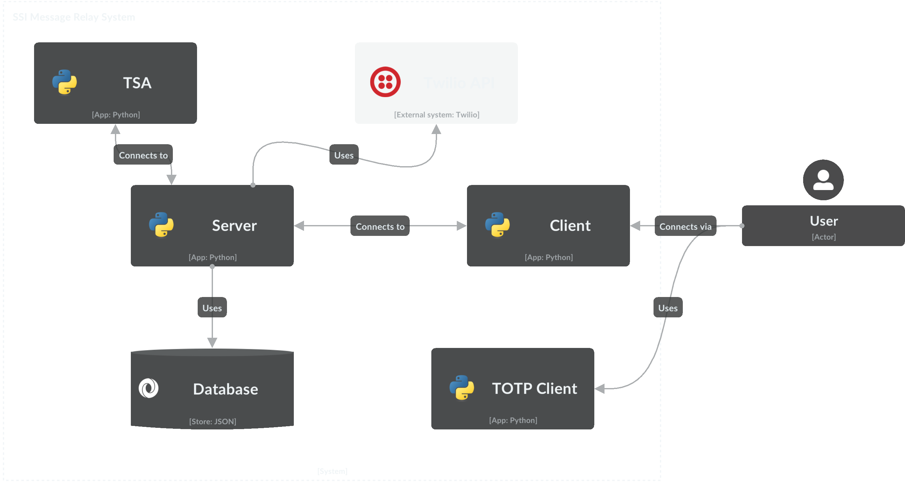
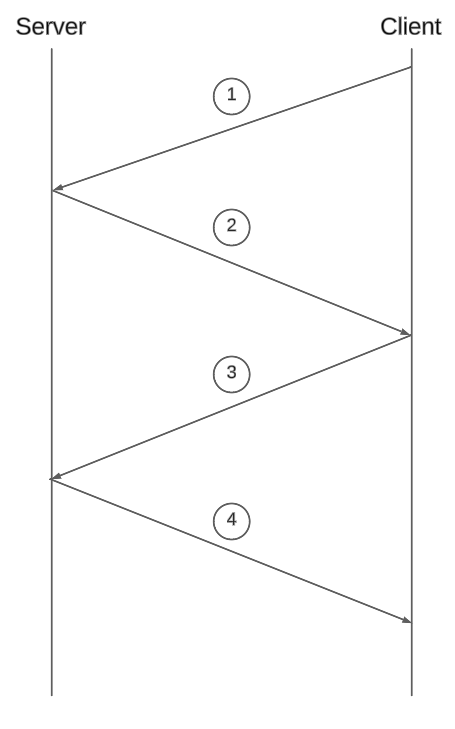
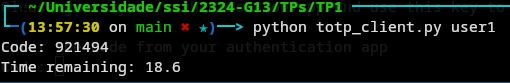

# MESSAGE RELAY SYSTEM

## Índice
1. [Introdução](#introdução)
2. [Arquitetura](#arquitetura)
3. [Identificação do Utilizador](#identificação-do-utilizador)
4. [Comunicação Cliente/Servidor](#comunicação-clienteservidor)
    1. [Handshake](#handshake)
    2. [Protocolo de Comunicação](#protocolo-de-comunicação)
5. [Sistema de Login e Registo](#sistema-de-login-e-registo)
6. [Troca de Mensagens entre Utilizadores](#troca-de-mensagens-entre-utilizadores)
7. [Funcionalidades do Cliente](#funcionalidades-do-cliente)
8. [Certificados](#certificados)
    1. [Validação de Certificados](#validação-de-certificados)
    2. [Geração de Certificados](#geração-de-certificados)
9. [Validação de Timestamps](#validação-de-timestamps)
10. [Armazenamento de Informação](#armazenamento-de-informação)
    1. [Base de Dados](#base-de-dados)
    2. [Logs](#logs)
11. [Two Factor Authentication](#two-factor-authentication)
    1. [Autenticação por TOTP (Time-based One-Time Password) Client](#autenticação-por-totp-time-based-one-time-password-client)
    2. [Autenticação por SMS](#autenticação-por-sms)
12. [Conclusão e futuras melhorias](#conclusão-e-futuras-melhorias)

## Introdução

Este projeto tem como objetivo a implementação de um sistema de mensagens seguras, que permita a troca de mensagens entre utilizadores de forma segura e autenticada. Para tal, foi implementado um sistema de comunicação cliente/servidor, que permite a troca de mensagens entre utilizadores, com autenticação e encriptação de mensagens. O sistema garante a autenticação de utilizadores através de certificados digitais, a validação de timestamps e a autenticação de dois fatores, através de TOTP (Time-based One-Time Password) e SMS. O sistema armazena informação relativa a utilizadores, mensagens e logs, numa base de dados.

## Arquitetura



A figura acima representa a arquitetura do sistema implementado. O sistema é composto por um servidor, que gere a comunicação entre os clientes, e vários clientes, que comunicam entre si através do servidor. O servidor é responsável por gerir a comunicação entre os clientes, autenticar os utilizadores, validar certificados e armazenar informação relativa a utilizadores, mensagens e logs. Os clientes são responsáveis por enviar e receber mensagens, autenticar-se no servidor, gerar certificados e timestamps, e autenticar-se através de dois fatores.
A base de dados é um ficheiro json que armazena informação relativa a todos os utilizadores e as suas mensagens. A base de dados é acedida pelo servidor, que lê e escreve informação na base de dados, de acordo com as operações realizadas pelos clientes.
O servidor utiliza também a API do Twilio para enviar mensagens SMS, para autenticação de dois fatores.
O cliente usa o programa 'TOTP Client' para gerar códigos TOTP, que são usados para autenticação de dois fatores.
Para validar os timestamps das mensagens, o servidor conecta-se a uma TSA (Timestamp Authority) que assina todos os timestamps das mensagens.

## Identificação do Utilizador

Toda a informação relativa a um utilizador está contida num ficheiro `pkcs12` que contém a chave RSA privada, o seu certificado x509 e o certificado CA que assinou o certificado do utilizador. O cliente lê o ficheiro `pkcs12` e extrai a chave privada e o certificado do utilizador.
O servidor indexa todos os seus utilizadores pelo seu username ao invés de id, para assim conseguirmos manter uma persistência de utilizadores mesmo que o id seja alterado e também conseguirmos adicionar fator personalizável à autenticação de um utilizador, passo que trará vantagens em termos de segurança.

## Comunicação Cliente/Servidor

### Handshake



A ligação entre o servidor e um cliente tem de ser feita através de um canal seguro, para assim garantir a confidencialidade e integridade das mensagens trocadas. Para tal, o servidor possui também uma chave RSA privada e um certificado assinado pela CA.
Para estabelecermos este canal seguro entre o cliente e o servidor, é necessário realizar um handshake, que consiste em aplicar o protocolo Diffie-Hellman para trocar chaves simétricas, e depois usar estas chaves para encriptar e desencriptar as mensagens trocadas entre o cliente e o servidor. De forma a garantir a autenticidade do servidor, o cliente verifica o certificado do servidor, e vice versa.
Para garantir a integridade das mensagens trocadas neste handshake, cada mensagem é assinada digitalmente com a chave privada do emissor, e verificada com a chave pública do recetor contida no certificado do emissor.

Durante este processo estão envolvidas as seguintes primitivas criptográficas:
- RSA: para assinar e verificar mensagens
    - `RSA_priv_s` : chave RSA privada do servidor
    - `RSA_pub_s` : chave RSA pública do servidor
    - `RSA_priv_c` : chave RSA privada do cliente
    - `RSA_pub_c` : chave RSA pública do cliente
- Certificados x509: para autenticar cada entidade
    - `CA`: certificado da CA
    - `Cert_s` : certificado do servidor
    - `Cert_c` : certificado do cliente
- Diffie-Hellman: para trocar chaves simétricas
    - `DH_priv_s` : chave Diffie-Hellman privada do servidor
    - `DH_pub_s` : chave Diffie-Hellman pública do servidor
    - `DH_priv_c` : chave Diffie-Hellman privada do cliente
    - `DH_pub_c` : chave Diffie-Hellman pública do cliente
    - `K_s` : chave simétrica do servidor
    - `K_c` : chave simétrica do cliente
- HKDF: para derivar chaves simétricas
- AES: para encriptar e desencriptar mensagens

De forma a completar a imagem acima apresentada, o handshake é composto por 4 mensagens, que são trocadas entre o cliente e o servidor, de forma a estabelecer um canal seguro de comunicação:

1. O cliente envia a sua chave Diffie-Hellman pública ao servidor.
2. O servidor recebe a chave Diffie-Hellman pública do cliente, e envia a sua chave Diffie-Hellman pública ao cliente, juntamente com o seu certificado e com a assinatura do par da sua chave Diffie-Hellman pública com a chave Diffie-Hellman pública do cliente.
Este último elemento enviado é importante para o cliente conseguir verificar a integridade de ambas as chaves Diffie-Hellman públicas.
O cliente verifica o certificado enviado pelo servidor constrói o par das duas chaves DIffie-Hellman públicas para verificar a assinatura do servidor.
3. O cliente envia o seu certificado e a assinatura do par das chaves Diffie-Hellman públicas para o servidor. O servidor verifica o certificado do cliente e a assinatura do par das chaves Diffie-Hellman públicas.
Se tudo estiver correto, o servidor gera a chave Diffie-Hellman partilhada, com esta deriva outra chave utilizando o HKDF e por último gera a chave simétrica AESGCM.
Envia depois uma mensagem ao cliente a informar que o handshake foi bem sucedido.
4. O cliente recebe a mensagem do servidor e gera a chave Diffie-Hellman partilhada, deriva a chave com o HKDF e gera a chave simétrica AESGCM, concluindo assim o handshake.

O uso adicional do HKDF é importante para garantir que a chave simétrica gerada é única e segura, e que não é possível derivar a chave privada a partir da chave simétrica.
A escolha do AESGCM para encriptar as mensagens trocadas entre o cliente e o servidor foi feita devido à sua segurança e eficiência. O AESGCM é um modo de operação do AES que garante a confidencialidade, integridade e autenticidade das mensagens trocadas, através da encriptação e autenticação das mensagens, garantindo assim a segurança do canal de comunicação.


### Protocolo de Comunicação

De forma a garantir a consistência e segurança das mensagens trocadas entre o cliente e o servidor, foi implementado um protocolo de comunicação que define a estrutura das mensagens trocadas entre o cliente e o servidor, e as operações que podem ser realizadas por cada entidade.

Um pacote de comunicação é composto pelo seu tipo e pelo seu conteúdo. O tipo de um pacote varia consoante a operação que se pretende realizar, e o conteúdo de um pacote varia consoante o tipo do pacote. Tanto o servidor como o cliente conseguem identificar o tipo de um pacote e assim saber como processar o conteúdo do pacote.

## Sistema de Login e Registo

Para adicionar robustez ao sistema, foi implementado um sistema de login e registo de utilizadores, que permite a autenticação de utilizadores no servidor, e a criação de novos utilizadores. Este funcionalidade permite também um maior controlo sobre os utilizadores, garantindo que estes são únicos e autênticos.

Se se inicializar o cliente sem nenhuma flag, o cliente começará na página de registo, pedindo ao utilizador para indicar um username e uma password. Após este breve registo, o cliente pergunta ao servidro se o username já existe, se sim, o cliente avisa o utilizador. Se não exstir, então este utilizador é criado na base de dados do servidor e o redirecionado para a página principal do cliente. Em pararelo, é criado o ficheiro `pkcs12` do utilizador, que contém a sua chave privada RSA, o seu certificado x509 e o certificado CA que assinou o certificado do utilizador. Este ficheiro é encriptado com a password do utilizador e na pasta dos certificados do cliente.

Sempre que o utilizador quiser fazer login com o seu username existente, tem de indicar a flag `-user` seguido do caminho para o ficheiro `pkcs12`. Será então pedido o username e a password ao utilizador para verificar tanto se a password é a correta para desencriptar o ficheiro `pkcs12`, como se o username é o correto para verificar o certificado. Se tudo estiver correto, o cliente notifica o servidor de qual utilizador é que acabou de fazer login e o servidor responde com uma mensagem de sucesso.

É de notar que antes do cliente especificar qual o seu utilizador que está a fazer login ou aquando o registo de um novo utilizador, o cliente tem de fazer o handshake com o servidor, para garantir a segurança da comunicação. Para isso são usadas as informações de um utilizador 'default' em que o servidor confia, podendo assim ser establecido o canal seguro de comunicação mesmo antes de o utilizador se autenticar.

Uma característica importante deste login é que o servidor não guarda a password do utilizador, mas sim o seu hash, garantindo assim a confidencialidade da password do utilizador. O primeiro pensamento para a implementação deste sistema seria o cliente enviar a password que estava a tentar e o servidor verificar se o hash dessa password era igual ao hash guardado na base de dados. No entanto, isto não é seguro, pois se um atacante conseguir aceder à base de dados, consegue ver todas as passwords dos utilizadores. Assim, o servidor guarda o hash da password do utilizador, e quando o utilizador tenta fazer login, o servidor envia a hash da password guardada na base de dados para aquele username, e o cliente verifica se a hash da password que está a tentar é igual à hash enviada pelo servidor. Se for, então a password está correta e o login é bem sucedido.

Este processo de autenticação pod-se tornar mais complexo se for adicionado um fator de autenticação adicional, como por exemplo um código TOTP ou um código enviado por SMS. Estes processos são explicados mais detalhadamente nas secções seguintes.

## Funcionalidades do Cliente

A página principal deste programa é uma interface de linha de comandos que permite ao utilizador interagir com o programa de uma forma simples e intuitiva. Para visualizar todos os comandos disponíveis basta escrever `help` na linha de comandos.

Estas são as funcionalidades disponíveis para o utilizador:
- `send <USERNAME> <SUBJECT>`: Envia uma mensagem para o utilizador com o username indicado, com o assunto indicado. O corpo da mensagem é escrito de seguida na linha de comandos.
- `askqueue`: Pede ao servidor para enviar todas as mensagens que estão na fila de mensagens não lidas do utilizador.
- `getmsg <NUM>`: Pede ao servidor para enviar a mensagem com o número indicado.
- `getallmsgs`: Pede ao servidor para enviar todas as mensagens do utilizador.
- `getmsgsfrom <USERNAME>`: Pede ao servidor para enviar todas as mensagens recebidas do utilizador com o username indicado.
- `2fa`: Direciona para o menu de autenticação de dois fatores.
- `exit`: Termina a sessão do utilizador e fecha o programa.

## Armazenamento de Informação

De forma a garantir a persistência da informação relativa a utilizadores, mensagens e logs, foi implementado um sistema de armazenamento de informação, que permite a leitura e escrita de informação numa base de dados.

### Base de Dados

A base de dados é um ficheiro json que armazena informação relativa a todos os utilizadores e as suas mensagens. A base de dados é acedida pelo servidor, que lê e escreve informação na base de dados, de acordo com as operações realizadas pelos clientes. Cada chave é o username do utilizador e o seu valor é um objeto com a informação relativa ao utilizador:

```json
{
    "username": {
        "msg_count": "message count",
        "messages": [
            {
                "num": "message number",
                "sender": "sender's username",
                "message": "hashed message",
                "timestamp": "timestamp",
                "key": "key used to encrypt message, encrypted with 'username' cert",
                "signature": "signature of message, signed with sender RSA private key" ,
                "tsa_signature": "signature of timestamp, signed with TSA private key",
                "is_read": "if message was read"
            }
        ],
        "hashed_password": "hashed password",
        "cert": "sender's cert",
        "two_fa": "2fa method (totp/msg)",
        "two_fa_key": "2fa key",
        "phone_number": "phone number"
    }
}
```

Todos os campos que são do tipo `bytes` são armazenados no formato `base64` para facilitar a leitura e escrita na base de dados.

### Logs

Para registar as ações de todos os utilizadores, assim como as do servidor, foi implementado um systema de logging no servidor. Com recurso à biblioteca `logging`, cada ação é exibida no `stdout` do servidor assim como num ficheiro `server.log`, tudo de uma forma visualmente apelativa.
Desta forma é possível monitorizar todas as ações realizadas no servidor, assim como detetar possíveis falhas de segurança ou erros no sistema.

Exemplo:
```
2024-04-07 10:54:42,192 - INFO - Serving on ('127.0.0.1', 8443)
2024-04-07 10:54:43,714 - INFO - Connection established successfully with client [1]
2024-04-07 10:54:47,342 - INFO - Client [1] registered successfully with username 'user1'.
2024-04-07 10:54:54,691 - INFO - Connection established successfully with client [2]
2024-04-07 10:54:57,967 - INFO - Client [2] registered successfully with username 'user2'.
2024-04-07 10:55:03,659 - INFO - [user1]'s certificate sent to client [user2]
2024-04-07 10:55:03,662 - INFO - Message from client [user2] sent successfully to client [user1]
2024-04-07 10:55:07,800 - INFO - Client [user1] asked for messages in queue
2024-04-07 10:55:11,637 - INFO - Received a request for a message from client [user1]
```

## Troca de Mensagens entre Utilizadores

Para garantir a confidencialidade e integridade das mensagens trocadas entre utilizadores, foi implementado um sistema de troca de mensagens que encripta e assina digitalmente as mensagens, de forma a garantir a segurança e autenticidade das mensagens. Para além disso, as mensagens são encriptadas de modo a que só o recetor consiga desencriptar a mensagem, garantindo assim a confidencialidade das mensagens. Com este método é garantida a integridade, confidencialidade e autenticidade das mensagens trocadas entre utilizadores.

Eis uma descrição de como funciona:

1. Este processo começa com um utilizador a executar o comando `send`. A primeira coisa que o cliente faz após a execução deste comando é pedir ao servidor para enviar o certificado do recetor da mensagem.
2. O servidor recebe o pedido do cliente e envia o certificado do recetor da mensagem.
3. Após receção do certificado, o utilizador valida se o certificado é válido e se é do recetor da mensagem. Se tudo estiver correto, o utilizador gera uma chave simétrica (AESGCM) e encripta a mensagem com esta chave. Assina também este mensagem com a sua chave RSA privada e de seguida, encripta a chave simétrica com a chave pública do recetor, de forma a que só o recetor consiga desencriptar a mensagem.
No final deste passo o cliente envia um pacote com a mensagem encriptada, a chave simétrica encriptada e a assinatura da mensagem.
Desta forma garantimos que existe confidencialidade pois a única pessoa que consegue desencriptar a mensagem é o recetor, integridade pois a mensagem é assinada digitalmente e autenticidade pois o recetor consegue verificar a assinatura com a chave pública do emissor.
4. O servidor, após receber este pacote, guarda as informações da mensagem numa estrutura de dados com outras informações adicionais, como o número da mensagem, o emissor, a chave simétrica encriptada e a assinatura da mensagem. É também adicionado um timestamp, que é assinado pela TSA.
5. Quando o recetor pede para ver a mensagem, o servidor envia todas as informações acima mencionadas para o recetor, juntamente com o certificado do emissor da mensagem.
6. O recetor, após receber a mensagem, valida o certificado do emissor, valida a assinatura da mensagem com o certificado do emissor, desencripta a chave simétrica com a sua chave privada, desencripta a mensagem com a chave simétrica e valida a autenticidade da timestamp, conseguindo assim ler a mensagem.

Esta metodologia garante a segurança e autenticidade das mensagens trocadas entre utilizadores, garantindo a confidencialidade, integridade e autenticidade das mensagens, mesmo perante o servidor.
Ao utilizar AESGCM, conseguimos encriptar as mensagens mais rapidamente, e mais importante, conseguimos encriptar mensagens maiores do que 2048 bits, que é o limite do RSA, pois o RSA só consegue encriptar mensagens até ao tamanho da sua chave, mesnagens maiores ficam inseguras.
Assim tiramos proveita das já utilizadas chaves RSA para encriptar a chave simétrica, e a chave simétrica para encriptar a mensagem.

## Certificados

Para garantir a autenticidade dos utilizadores, foi implementado um sistema de certificados digitais, que permite a autenticação de utilizadores através de certificados digitais, assinados por uma CA (Certificate Authority). Os certificados digitais são usados para autenticar os utilizadores no servidor, garantindo que os utilizadores são únicos e autênticos.

Com a utilização de usernames únicos por utilizador, é possível usar este fator como um fator de autenticação adicional, garantindo assim que o utilizador é único e autêntico. Este fator é o que distingue cada utilizador.
Como os certificados dados nos enunciados são auto-assinados e surgiu a necessidade de imbutir os usernames no pseudónimo dos certificados, foi necessário criar uma CA réplica da dada nos enunciados, para que fosse possível gerar e assinar novos certificados de utilizadores.

### Validação de Certificados

Para uma certificado ser considerado válido, é necessário que se cumpram os seguintes requisitos:
- O certificado é assinado pela CA estabelecida;
- O certificado está dentro do seu prazo de validade;
- O certificado contém o username do utilizador;
- O certificado contém as extensões críticas necessárias.

Como extensões críticas, são necessárias as extensões `BasicConstraints` e `keyUsage`, que são essenciais para garantir a segurança e autenticidade dos certificados.
A primeira garante que o certificado não é uma CA, e a segunda garante que o certificado é válido para assinar mensagens.

### Geração de Certificados

Como dito anteriormente, foi necessário criar uma CA réplica da dada nos enunciados, para que fosse possível gerar e assinar novos certificados de utilizadores e também imbutir o utilizador no pseudónimo. Para tal, foi criado um script que gera uma chave RSA privada e um certificado x509 para a CA, que é usada para assinar os certificados dos utilizadores.
Este script garante que todos os critérios necessários para um certificado ser considerado válido são cumpridos, e que o certificado é assinado pela CA.

É importante realçar que a geração do certificado, e consequentemente a geração do ficheiro `pkcs12`, é feita no cliente, garantindo assim que a chave privada do utilizador nunca é enviada para o servidor, garantindo a segurança e confidencialidade dos certificados. Mas antes deste ficheiro ser criado, o cliente tem de se autenticar no servidor, garantindo assim que o utilizador é autêntico e único.

## Validação de Timestamps

De modo a garantir a fiabilidade dos timestamps apresentados em cada mensagem, o servidor recorre a uma TSA (Timestamp Authority) para gerar e assinar todos os timestamps das mensagens. A TSA é outra aplicação que corre à parte, que recebe pedidos de timestamps e devolve a mensagem juntamente com um timestamp assinado com a chave privada da TSA.

Esta tarefa ocorre sempre que o servidor recebe uma mensagem de um cliente, antes de a guardar na base de dados. O servidor envia a mensagem para a TSA, que devolve a mensagem com o timestamp assinado, e o servidor guarda a mensagem com o timestamp assinado na base de dados.

Quando um cliente pede para ver uma mensagem, o servidor envia a mensagem com o timestamp assinado, e o cliente valida o timestamp com a chave pública da TSA, confirmando que o timestamp é válido e autêntico. Se não for então a mensagem é descartada.

## Two Factor Authentication

Assim como existe o sistema clássico de autenticação de utilizadores, por username e password, existe também a possibilidade de adicionar um fator de autenticação adicional, para assegurar uma maior segurança aos utilizadores. Para tal, estão implementados dois métodos de autenticação de dois fatores.

### Autenticação por TOTP (Time-based One-Time Password) Client

Neste método, o utilizador dá uso ao programa TOTP Client `totp_client.py`, que gera códigos TOTP baseados numa chave secreta partilhada entre o servidor e o cliente, e também baseado no tempo atual.

O maior problema nesta implementação foi a sincronização entre o servidor e o cliente, pois o código TOTP é baseado no tempo atual, e se o tempo não estiver sincronizado entre o servidor e o cliente, o código TOTP gerado pelo cliente não será o mesmo que o gerado pelo servidor.

A solução encontrada foi a de arredondar o tempo atual para os 30 segundos mais próximos, de forma a garantir que o código TOTP gerado pelo cliente é o mesmo que o gerado pelo servidor. O utilizador tem 30 segundos para introduzi o código TOTP gerado pelo cliente no servidor, antes que o código expire. Como é baseado no tempo real, esse tempo pode nem sempre começar nos 30 segundos.

Quando esta opção é ativada, o servidor gera uma chave que partilha com o cliente. Este guarda a chave num ficheiro dentro na diretoria './otp_keys' e guarda o ficheiro com o nome do utilizador.
Quando o utilizador necessita do código TOTP, executa o programa `totp_client.py` seguido do seu username. O programa gera o código TOTP e mostra-o no terminal, assim como o tempo em contagem decrescente, como é visível na imagem abaixo.



Este método é o mais recomendado dos dois. A autenticação TOTP através de aplicações dedicadas é mais segura e fiável do que 2FA por SMS, devido à geração offline de códigos e à menor exposição a ataques de interceptação e manipulação de rede.

### Autenticação por SMS

Quando este modo é ativado, o servidor pede ao cliente para introduzir o seu número de telemóvel. O servidor envia um código de autenticação para o número de telemóvel do cliente, e o cliente tem de introduzir o código no servidor para se autenticar.

Para enviar mensagens SMS, o servidor utiliza a API do Twilio, que permite enviar mensagens SMS para qualquer número de telemóvel. O servidor envia um pedido à API do Twilio, que envia a mensagem SMS personalizada para o número de telemóvel do cliente.

## Conclusão e futuras melhorias

Foi com este trabalho bastante prático que conseguimos não só consolidar os conhecimentos adquiridos nas aulas teóricas, como também explorar novas possibilidades e desafios. Foi um trabalho desafiador e gratificante, dando-nos a liberdade de tomar decisões e implementar funcionlidades que achámos pertinentes e interessantes, assim como alterar levemente o enunciado para se adequar às nossas ambições, sem nunca perder de vista o objetivo principal do enunciado.
Quanto a melhorias no projeto, poderíamos implementar um sistema de notificações para o utilizador, sempre que este receba uma nova mensagem, ou até mesmo um sistema de encriptação de ficheiros, para que o utilizador possa enviar ficheiros encriptados para outros utilizadores. Outra melhoria seria a implementação de um sistema de autenticação de dois fatores mais robusto, como por exemplo a autenticação por biometria, que garantiria uma maior segurança na autenticação.
Em suma, estamos bastante satisfeitos com o resultado final do projeto, e acreditamos que conseguimos implementar um sistema de mensagens seguras, que cumpre todos os requisitos do enunciado, incluindo os extras do mesmo e ainda mais alguns.